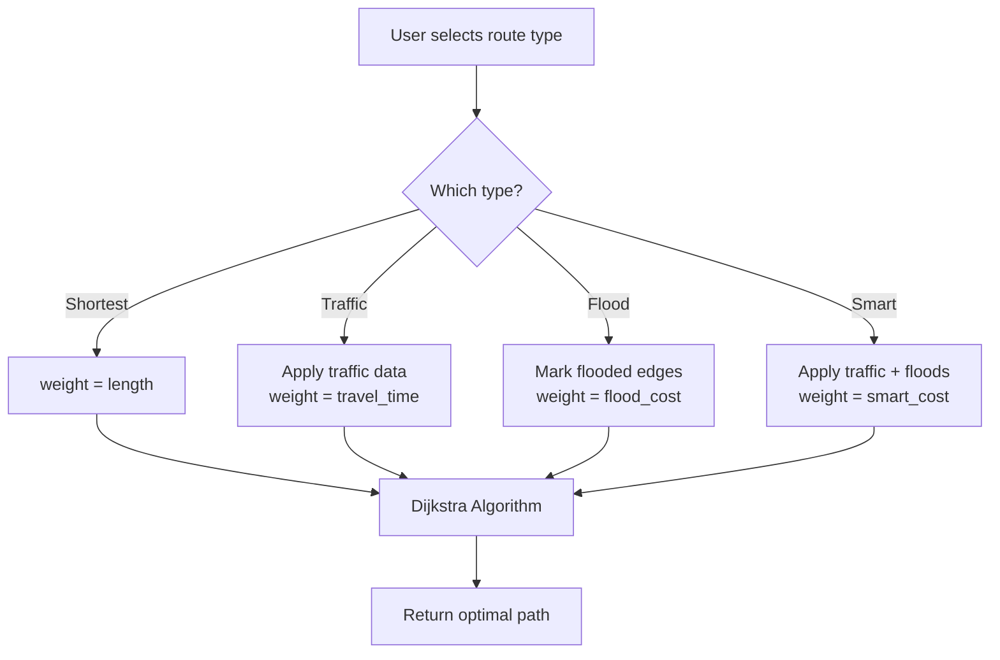

# How Rerouting Works: All 4 Scenarios Explained

## The Concept: Graph-Based Routing

Your road network is stored as a **graph** with:
- **Nodes** = Intersections (44,077 in Gurugram)
- **Edges** = Road segments connecting intersections (109,077 edges)

Each edge has attributes like:
- `length` (meters)
- `maxspeed` (km/h)
- `travel_time` (seconds)
- `is_flooded` (true/false)

---

## The Algorithm: Dijkstra's Shortest Path

All 4 route types use **Dijkstra's algorithm** but with different **cost functions**:

```
Route = Dijkstra(Graph, Origin, Destination, weight="cost_function")
```

The `weight` parameter determines what the algorithm minimizes.

---

## Example Road Network

Imagine traveling from **A** (Origin) to **D** (Destination):

```
        Route 1: A → B → D
                  ↓
    A ─────► B ─────► D
    │                 ▲
    │     Route 2     │
    └────► C ─────────┘
```

| Edge | Length (m) | Speed (km/h) | Is Flooded? |
|------|------------|--------------|-------------|
| A→B  | 500        | 40           | No          |
| B→D  | 800        | 30           | No          |
| A→C  | 600        | 50           | Yes         |
| C→D  | 400        | 60           | No          |

---

## 1️⃣ SHORTEST Route (Purple)

### Cost Function: `length`

**What it does**: Finds the path with minimum total distance.

### Calculation:
```
Route 1 (A→B→D): 500 + 800 = 1300 m
Route 2 (A→C→D): 600 + 400 = 1000 m ✓ WINNER
```

**Result**: Takes Route 2 even though it passes through flooded road!

> **Code Reference**:
> ```python
> weight = "length"
> route = nx.shortest_path(G, origin, dest, weight=weight)
> ```

---

## 2️⃣ TRAFFIC-AVOIDING Route (Brown)

### Cost Function: `travel_time`

**What it does**: Finds the path with minimum travel TIME considering traffic.

### Formula:
```
travel_time = length / current_speed

where:
  current_speed = free_flow_speed × speed_ratio
  speed_ratio = currentSpeed / freeFlowSpeed (from traffic data)
```

### Example with Traffic:

Suppose traffic data says:
- Edge A→C has `speed_ratio = 0.5` (heavy traffic, 50% of normal speed)
- All other edges have `speed_ratio = 1.0` (free flow)

**Step 1**: Calculate travel time for each edge:

| Edge | Length | Free Speed | Speed Ratio | Current Speed | Travel Time |
|------|--------|------------|-------------|---------------|-------------|
| A→B  | 500 m  | 40 km/h → 11.1 m/s | 1.0 | 11.1 m/s | 500/11.1 = **45 sec** |
| B→D  | 800 m  | 30 km/h → 8.3 m/s  | 1.0 | 8.3 m/s  | 800/8.3 = **96 sec**  |
| A→C  | 600 m  | 50 km/h → 13.9 m/s | 0.5 | 6.9 m/s  | 600/6.9 = **87 sec**  |
| C→D  | 400 m  | 60 km/h → 16.7 m/s | 1.0 | 16.7 m/s | 400/16.7 = **24 sec** |

**Step 2**: Compare routes:
```
Route 1 (A→B→D): 45 + 96 = 141 sec ✓ WINNER
Route 2 (A→C→D): 87 + 24 = 111 sec... wait, this is faster!
```

Actually Route 2 is faster even with traffic! But if `speed_ratio = 0.3`:
```
A→C travel_time = 600 / (13.9 × 0.3) = 144 sec
Route 2: 144 + 24 = 168 sec
Route 1: 141 sec ✓ WINNER
```

> **Code Reference**:
> ```python
> # Apply traffic to edge
> current_speed_kph = free_flow_kph * speed_ratio
> speed_mps = current_speed_kph * 1000 / 3600
> data["travel_time"] = length / speed_mps
> 
> # Route with travel_time
> weight = "travel_time"
> ```

---

## 3️⃣ FLOOD-AVOIDING Route (Ocean Blue)

### Cost Function: `flood_cost = length + flood_penalty`

**What it does**: Avoids flooded roads by adding HUGE penalty to them.

### Formula:
```
flood_cost = length                    (if NOT flooded)
flood_cost = length + 1,000,000 m      (if flooded)
```

### Example:

| Edge | Length | Is Flooded? | Flood Penalty | Flood Cost |
|------|--------|-------------|---------------|------------|
| A→B  | 500 m  | No          | 0             | **500 m**  |
| B→D  | 800 m  | No          | 0             | **800 m**  |
| A→C  | 600 m  | **Yes**     | 1,000,000     | **1,000,600 m** |
| C→D  | 400 m  | No          | 0             | **400 m**  |

**Compare routes:**
```
Route 1 (A→B→D): 500 + 800 = 1,300 m ✓ WINNER
Route 2 (A→C→D): 1,000,600 + 400 = 1,001,000 m (effectively infinite!)
```

The penalty is so large that the algorithm will NEVER choose a flooded road unless there's no other option.

> **Code Reference**:
> ```python
> FLOOD_PENALTY = 1_000_000.0
> 
> if edge_is_flooded:
>     data["flood_cost"] = length + FLOOD_PENALTY
> else:
>     data["flood_cost"] = length
> 
> weight = "flood_cost"
> ```

---

## 4️⃣ SMART Route (Black)

### Cost Function: `smart_cost = travel_time + flood_penalty`

**What it does**: Combines BOTH traffic awareness AND flood avoidance.

### Formula:
```
smart_cost = travel_time                        (if NOT flooded)
smart_cost = travel_time + 1,000,000 sec        (if flooded)
```

### Example (combining both):

| Edge | Travel Time | Is Flooded? | Flood Penalty | Smart Cost |
|------|-------------|-------------|---------------|------------|
| A→B  | 45 sec      | No          | 0             | **45 sec** |
| B→D  | 96 sec      | No          | 0             | **96 sec** |
| A→C  | 87 sec      | **Yes**     | 1,000,000     | **1,000,087 sec** |
| C→D  | 24 sec      | No          | 0             | **24 sec** |

**Compare routes:**
```
Route 1 (A→B→D): 45 + 96 = 141 sec ✓ WINNER
Route 2 (A→C→D): 1,000,087 + 24 = 1,000,111 sec (effectively infinite!)
```

> **Code Reference**:
> ```python
> smart_cost = travel_time + (FLOOD_PENALTY if is_flooded else 0)
> weight = "smart_cost"
> ```

---

## Summary Table

| Route Type | Weight Used | What It Minimizes | Avoids Traffic? | Avoids Floods? |
|------------|-------------|-------------------|-----------------|----------------|
| Shortest   | `length`    | Distance (meters) | ❌              | ❌             |
| Traffic    | `travel_time` | Time (seconds)  | ✅              | ❌             |
| Flood      | `flood_cost`  | Distance + penalty | ❌           | ✅             |
| Smart      | `smart_cost`  | Time + penalty  | ✅              | ✅             |

---

## Why Routes Sometimes Look the Same?

1. **Traffic data is sparse**: Only 10 traffic monitoring points in Gurugram
2. **Flood data needs to intersect**: The route must pass through flooded areas
3. **Alternative paths must exist**: If there's only one road, no rerouting possible

---

## Visual Flow


